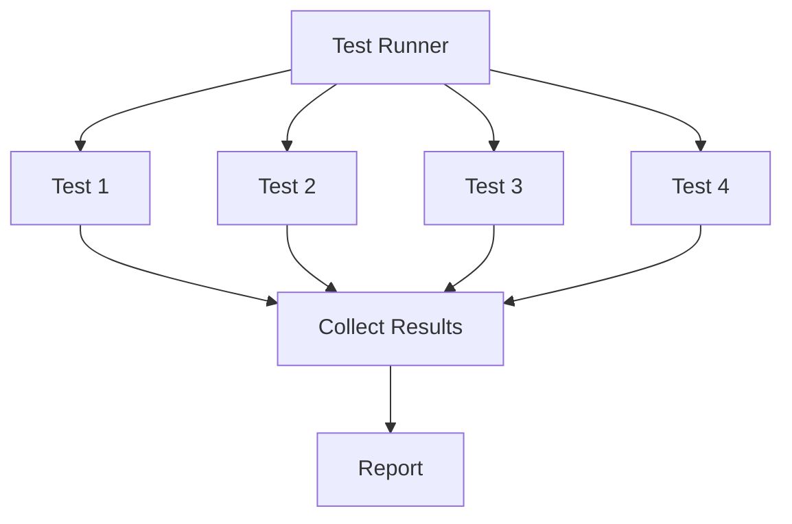

<div align="center">
  
  <h1>Dream Test</h1>
  <p><strong>A testing framework for Gleam that gets out of your way.</strong></p>

  <a href="https://hex.pm/packages/dream_test">
    
  </a>
  <a href="https://hexdocs.pm/dream_test/">
    
  </a>
  <a href="https://github.com/TrustBound/dream_test/blob/main/LICENSE">
    
  </a>
</div>

<br>

```gleam
import dream_test/unit.{describe, it}
import dream_test/assertions/should.{be_error, be_ok, equal, or_fail_with, should}

pub fn tests() {
  describe("Calculator", [
    it("adds two numbers", fn() {
      add(2, 3)
      |> should()
      |> equal(5)
      |> or_fail_with("2 + 3 should equal 5")
    }),
    it("handles division", fn() {
      divide(10, 2)
      |> should()
      |> be_ok()
      |> equal(5)
      |> or_fail_with("10 / 2 should equal 5")
    }),
    it("returns error for division by zero", fn() {
      divide(1, 0)
      |> should()
      |> be_error()
      |> or_fail_with("Division by zero should error")
    }),
  ])
}
```

```
Calculator
  ✓ adds two numbers
  ✓ handles division
  ✓ returns error for division by zero

Summary: 3 run, 0 failed, 3 passed in 2ms
```

<sub>🧪 [Tested source](examples/snippets/test/hero.gleam)</sub>

---

## Contents

- [Installation](#installation)
- [Why Dream Test?](#why-dream-test)
- [Quick Start](#quick-start)
- [The Assertion Pattern](#the-assertion-pattern)
- [Lifecycle Hooks](#lifecycle-hooks)
- [Snapshot Testing](#snapshot-testing)
- [Gherkin / BDD Testing](#gherkin--bdd-testing)
- [BEAM-Powered Test Isolation](#beam-powered-test-isolation)
- [Tagging, CI & Reporters](#tagging-ci--reporters)
- [How It Works](#how-it-works)

---

## Installation

```toml
# gleam.toml
[dev-dependencies]
dream_test = "~> 1.2"
```

---

## Why Dream Test?

| Feature                 | What you get                                                                 |
| ----------------------- | ---------------------------------------------------------------------------- |
| **Blazing fast**        | Parallel execution + BEAM lightweight processes = 214 tests in 300ms         |
| **Parallel by default** | Tests run concurrently across all cores—configurable concurrency             |
| **Crash-proof**         | Each test runs in an isolated BEAM process; one crash doesn't kill the suite |
| **Timeout-protected**   | Hanging tests get killed automatically; no more stuck CI pipelines           |
| **Lifecycle hooks**     | `before_all`, `before_each`, `after_each`, `after_all` for setup/teardown    |
| **Snapshot testing**    | Compare output against golden files; auto-create on first run                |
| **Tagging & filtering** | Tag tests and run subsets with custom filter predicates                      |
| **Gleam-native**        | Pipe-first assertions that feel natural; no macros, no reflection, no magic  |
| **Multiple reporters**  | BDD-style human output or JSON for CI/tooling integration                    |
| **Familiar syntax**     | If you've used Jest, RSpec, or Mocha, you already know the basics            |
| **Type-safe**           | Your tests are just Gleam code; the compiler catches mistakes early          |
| **Gherkin/BDD**         | Write specs in plain English with Cucumber-style Given/When/Then             |
| **Self-hosting**        | Dream Test tests itself; we eat our own cooking                              |

---

## Quick Start

### 1. Write tests with `describe` and `it`

```gleam
// test/my_app_test.gleam
import dream_test/unit.{describe, it, to_test_cases}
import dream_test/runner.{exit_on_failure, run_all}
import dream_test/reporter/bdd.{report}
import dream_test/assertions/should.{should, equal, or_fail_with}
import gleam/io
import gleam/string

pub fn tests() {
  describe("String utilities", [
    it("trims whitespace", fn() {
      "  hello  "
      |> string.trim()
      |> should()
      |> equal("hello")
      |> or_fail_with("Should remove surrounding whitespace")
    }),
    it("finds substrings", fn() {
      "hello world"
      |> string.contains("world")
      |> should()
      |> equal(True)
      |> or_fail_with("Should find 'world' in string")
    }),
  ])
}

pub fn main() {
  to_test_cases("my_app_test", tests())
  |> run_all()
  |> report(io.print)
  |> exit_on_failure()
}
```

<sub>🧪 [Tested source](examples/snippets/test/quick_start.gleam)</sub>

### 2. Run with gleam test

```sh
gleam test
```

### 3. See readable output

```
String utilities
  ✓ trims whitespace
  ✓ finds substrings

Summary: 2 run, 0 failed, 2 passed in 1ms
```

---

## The Assertion Pattern

Every assertion follows the same pattern:

```gleam
value |> should() |> matcher() |> or_fail_with("message")
```

### Chaining matchers

Matchers can be chained. Each one passes its unwrapped value to the next:

```gleam
// Unwrap Some, then check the value
Some(42)
|> should()
|> be_some()
|> equal(42)
|> or_fail_with("Should contain 42")

// Unwrap Ok, then check the value
Ok("success")
|> should()
|> be_ok()
|> equal("success")
|> or_fail_with("Should be Ok with 'success'")
```

<sub>🧪 [Tested source](examples/snippets/test/chaining.gleam)</sub>

### Available matchers

| Category        | Matchers                                                                                    |
| --------------- | ------------------------------------------------------------------------------------------- |
| **Equality**    | `equal`, `not_equal`                                                                        |
| **Boolean**     | `be_true`, `be_false`                                                                       |
| **Option**      | `be_some`, `be_none`                                                                        |
| **Result**      | `be_ok`, `be_error`                                                                         |
| **Collections** | `contain`, `not_contain`, `have_length`, `be_empty`                                         |
| **Comparison**  | `be_greater_than`, `be_less_than`, `be_at_least`, `be_at_most`, `be_between`, `be_in_range` |
| **String**      | `start_with`, `end_with`, `contain_string`                                                  |
| **Snapshot**    | `match_snapshot`, `match_snapshot_inspect`                                                  |

### Custom matchers

Create your own matchers by working with `MatchResult(a)`. A matcher receives a result, checks if it already failed (propagate), or validates the value:

```gleam
import dream_test/types.{
  type MatchResult, AssertionFailure, CustomMatcherFailure, MatchFailed, MatchOk,
}
import gleam/option.{Some}

pub fn be_even(result: MatchResult(Int)) -> MatchResult(Int) {
  case result {
    // Propagate existing failures
    MatchFailed(failure) -> MatchFailed(failure)
    // Check our condition
    MatchOk(value) -> case value % 2 == 0 {
      True -> MatchOk(value)
      False -> MatchFailed(AssertionFailure(
        operator: "be_even",
        message: "",
        payload: Some(CustomMatcherFailure(
          actual: int.to_string(value),
          description: "expected an even number",
        )),
      ))
    }
  }
}
```

Use it like any built-in matcher:

```gleam
4
|> should()
|> be_even()
|> or_fail_with("Should be even")
```

<sub>🧪 [Tested source](examples/snippets/test/custom_matchers.gleam)</sub>

### Explicit success and failure

When you need to explicitly succeed or fail in conditional branches:

```gleam
import dream_test/assertions/should.{fail_with, succeed}

case result {
  Ok(_) -> succeed()
  Error(_) -> fail_with("Should have succeeded")
}
```

<sub>🧪 [Tested source](examples/snippets/test/explicit_failures.gleam)</sub>

### Skipping tests

Use `skip` instead of `it` to temporarily disable a test:

```gleam
import dream_test/unit.{describe, it, skip}

describe("Feature", [
  it("works correctly", fn() { ... }),
  skip("not implemented yet", fn() { ... }),  // Skipped
  it("handles edge cases", fn() { ... }),
])
```

```
Feature
  ✓ works correctly
  - not implemented yet
  ✓ handles edge cases

Summary: 3 run, 0 failed, 2 passed, 1 skipped
```

The test body is preserved but not executed—just change `skip` back to `it` when ready.

<sub>🧪 [Tested source](examples/snippets/test/skipping_tests.gleam)</sub>

---

## Lifecycle Hooks

Setup and teardown logic for your tests. Dream_test supports four lifecycle hooks
that let you run code before and after tests.

```gleam
import dream_test/unit.{describe, it, before_each, after_each, before_all, after_all}
import dream_test/assertions/should.{succeed}

describe("Database tests", [
  before_all(fn() {
    start_database()
    succeed()
  }),

  before_each(fn() {
    begin_transaction()
    succeed()
  }),

  it("creates a user", fn() { ... }),
  it("deletes a user", fn() { ... }),

  after_each(fn() {
    rollback_transaction()
    succeed()
  }),

  after_all(fn() {
    stop_database()
    succeed()
  }),
])
```

<sub>🧪 [Tested source](examples/snippets/test/lifecycle_hooks.gleam)</sub>

### Hook Types

| Hook          | Runs                              | Use case                          |
| ------------- | --------------------------------- | --------------------------------- |
| `before_all`  | Once before all tests in group    | Start services, create temp files |
| `before_each` | Before each test                  | Reset state, begin transaction    |
| `after_each`  | After each test (even on failure) | Rollback, cleanup temp data       |
| `after_all`   | Once after all tests in group     | Stop services, remove temp files  |

### Two Execution Modes

Choose the mode based on which hooks you need:

| Mode  | Function                      | Hooks supported             |
| ----- | ----------------------------- | --------------------------- |
| Flat  | `to_test_cases` → `run_all`   | `before_each`, `after_each` |
| Suite | `to_test_suite` → `run_suite` | All four hooks              |

**Flat mode** — simpler, faster; use when you only need per-test setup:

```gleam
import dream_test/unit.{describe, it, before_each, to_test_cases}
import dream_test/runner.{run_all}

to_test_cases("my_test", tests())
|> run_all()
|> report(io.print)
```

**Suite mode** — preserves group structure; use when you need once-per-group setup:

```gleam
import dream_test/unit.{describe, it, before_all, after_all, to_test_suite}
import dream_test/runner.{run_suite}

to_test_suite("my_test", tests())
|> run_suite()
|> report(io.print)
```

<sub>🧪 [Tested source](examples/snippets/test/execution_modes.gleam)</sub>

### Hook Inheritance

Nested `describe` blocks inherit parent hooks. Hooks run outer-to-inner for
setup, inner-to-outer for teardown:

```gleam
describe("Outer", [
  before_each(fn() {
    io.println("1. outer setup")
    succeed()
  }),
  after_each(fn() {
    io.println("4. outer teardown")
    succeed()
  }),
  describe("Inner", [
    before_each(fn() {
      io.println("2. inner setup")
      succeed()
    }),
    after_each(fn() {
      io.println("3. inner teardown")
      succeed()
    }),
    it("test", fn() {
      io.println("(test)")
      succeed()
    }),
  ]),
])
// Output: 1. outer setup → 2. inner setup → (test) → 3. inner teardown → 4. outer teardown
```

<sub>🧪 [Tested source](examples/snippets/test/hook_inheritance.gleam)</sub>

### Hook Failure Behavior

If a hook fails, Dream Test handles it gracefully:

| Failure in    | Result                                            |
| ------------- | ------------------------------------------------- |
| `before_all`  | All tests in group marked `SetupFailed`, skipped  |
| `before_each` | That test marked `SetupFailed`, skipped           |
| `after_each`  | Test result preserved; hook failure recorded      |
| `after_all`   | Hook failure recorded; all test results preserved |

```gleam
describe("Handles failures", [
  before_all(fn() {
    case connect_to_database() {
      Ok(_) -> succeed()
      Error(e) -> fail_with("Database connection failed: " <> e)
    }
  }),
  // If before_all fails, these tests are marked SetupFailed (not run)
  it("test1", fn() { succeed() }),
  it("test2", fn() { succeed() }),
])
```

<sub>🧪 [Tested source](examples/snippets/test/hook_failure.gleam)</sub>

---

## Snapshot Testing

Snapshot tests compare output against stored "golden" files. On first run, the snapshot is created automatically. On subsequent runs, any difference is a failure.

```gleam
import dream_test/assertions/should.{should, match_snapshot, or_fail_with}

it("renders user profile", fn() {
  render_profile(user)
  |> should()
  |> match_snapshot("./test/snapshots/user_profile.snap")
  |> or_fail_with("Profile should match snapshot")
})
```

| Scenario         | Behavior                    |
| ---------------- | --------------------------- |
| Snapshot missing | Creates it, test **passes** |
| Snapshot matches | Test **passes**             |
| Snapshot differs | Test **fails** with diff    |

**Updating snapshots** — delete the file and re-run the test:

```sh
rm ./test/snapshots/user_profile.snap
gleam test
```

**Testing non-strings** — use `match_snapshot_inspect` for complex data:

```gleam
build_config()
|> should()
|> match_snapshot_inspect("./test/snapshots/config.snap")
|> or_fail_with("Config should match snapshot")
```

This serializes values using `string.inspect`, so you can snapshot records, lists, tuples, etc.

**Clearing snapshots programmatically:**

```gleam
import dream_test/matchers/snapshot

// Clear one snapshot
let _ = snapshot.clear_snapshot("./test/snapshots/old.snap")

// Clear all .snap files in a directory
let _ = snapshot.clear_snapshots_in_directory("./test/snapshots")
```

<sub>🧪 [Tested source](examples/snippets/test/snapshot_testing.gleam)</sub>

---

## Gherkin / BDD Testing

Write behavior-driven tests using Cucumber-style Given/When/Then syntax.

### Inline DSL

Define features directly in Gleam—no `.feature` files needed:

```gleam
import dream_test/assertions/should.{succeed}
import dream_test/gherkin/feature.{feature, scenario, given, when, then}
import dream_test/gherkin/steps.{type StepContext, get_int, new_registry, step}
import dream_test/gherkin/world.{get_or, put}
import dream_test/types.{type AssertionResult}

fn step_have_items(context: StepContext) -> AssertionResult {
  put(context.world, "cart", get_int(context.captures, 0) |> result.unwrap(0))
  succeed()
}

fn step_add_items(context: StepContext) -> AssertionResult {
  let current = get_or(context.world, "cart", 0)
  let to_add = get_int(context.captures, 0) |> result.unwrap(0)
  put(context.world, "cart", current + to_add)
  succeed()
}

fn step_should_have(context: StepContext) -> AssertionResult {
  let expected = get_int(context.captures, 0) |> result.unwrap(0)
  get_or(context.world, "cart", 0)
  |> should()
  |> equal(expected)
  |> or_fail_with("Cart count mismatch")
}

pub fn tests() {
  let steps =
    new_registry()
    |> step("I have {int} items in my cart", step_have_items)
    |> step("I add {int} more items", step_add_items)
    |> step("I should have {int} items total", step_should_have)

  feature("Shopping Cart", steps, [
    scenario("Adding items to cart", [
      given("I have 3 items in my cart"),
      when("I add 2 more items"),
      then("I should have 5 items total"),
    ]),
  ])
}
```

```
Feature: Shopping Cart
  Scenario: Adding items to cart ✓ (3ms)

1 scenario (1 passed) in 3ms
```

<sub>🧪 [Tested source](examples/snippets/test/gherkin_hero.gleam)</sub>

### .feature File Support

Parse standard Gherkin `.feature` files:

```gherkin
# test/cart.feature
@shopping
Feature: Shopping Cart
  As a customer I want to add items to my cart

  Background:
    Given I have an empty cart

  @smoke
  Scenario: Adding items
    When I add 3 items
    Then the cart should have 3 items
```

<sub>🧪 [Tested source](examples/snippets/test/cart.feature)</sub>

```gleam
import dream_test/gherkin/feature.{FeatureConfig, to_test_suite}
import dream_test/gherkin/parser

pub fn tests() {
  let steps = new_registry() |> register_steps()

  // Parse the .feature file
  let assert Ok(feature) = parser.parse_file("test/cart.feature")

  // Convert to TestSuite
  let config = FeatureConfig(feature: feature, step_registry: steps)
  to_test_suite("cart_test", config)
}
```

<sub>🧪 [Tested source](examples/snippets/test/gherkin_file.gleam)</sub>

### Step Placeholders

Capture values from step text using typed placeholders:

| Placeholder | Matches              | Example         |
| ----------- | -------------------- | --------------- |
| `{int}`     | Integers             | `42`, `-5`      |
| `{float}`   | Decimals             | `3.14`, `-0.5`  |
| `{string}`  | Quoted strings       | `"hello world"` |
| `{word}`    | Single unquoted word | `alice`         |

Numeric placeholders work with prefixes/suffixes—`${float}` matches `$19.99` and captures `19.99`:

```gleam
fn step_have_balance(context: StepContext) -> AssertionResult {
  // {float} captures the numeric value (even with $ prefix)
  let balance = get_float(context.captures, 0) |> result.unwrap(0.0)
  put(context.world, "balance", balance)
  succeed()
}

pub fn register(registry: StepRegistry) -> StepRegistry {
  registry
  |> step("I have a balance of ${float}", step_have_balance)
  |> step("I withdraw ${float}", step_withdraw)
  |> step("my balance should be ${float}", step_balance_is)
}
```

<sub>🧪 [Tested source](examples/snippets/test/gherkin_step_handler.gleam)</sub>

### Background & Tags

Use `background` for shared setup and `with_tags` for filtering:

```gleam
import dream_test/gherkin/feature.{
  background, feature_with_background, scenario, with_tags,
}

pub fn tests() {
  let bg = background([given("I have an empty cart")])

  feature_with_background("Shopping Cart", steps, bg, [
    scenario("Adding items", [
      when("I add 3 items"),
      then("I should have 3 items"),
    ])
      |> with_tags(["smoke"]),
    scenario("Adding more items", [
      when("I add 2 items"),
      and("I add 3 items"),
      then("I should have 5 items"),
    ]),
  ])
}
```

<sub>🧪 [Tested source](examples/snippets/test/gherkin_feature.gleam)</sub>

### Feature Discovery

Load multiple `.feature` files with glob patterns:

```gleam
import dream_test/gherkin/discover

pub fn tests() {
  let steps = new_registry() |> register_steps()

  // Discover and load all .feature files
  discover.features("test/**/*.feature")
  |> discover.with_registry(steps)
  |> discover.to_suite("my_features")
}
```

<sub>🧪 [Tested source](examples/snippets/test/gherkin_discover.gleam)</sub>

Supported glob patterns:

| Pattern              | Matches                                   |
| -------------------- | ----------------------------------------- |
| `features/*.feature` | All `.feature` files in `features/`       |
| `test/**/*.feature`  | Recursive search in `test/`               |
| `*.feature`          | All `.feature` files in current directory |

### Parallel Execution

Gherkin scenarios run in parallel like all other tests. Each scenario gets its own isolated World state, but external resources (databases, servers) are shared. See [Shared Resource Warning](#shared-resource-warning) for guidance on handling shared state.

### Full Example

See [examples/shopping_cart](examples/shopping_cart) for a complete Gherkin BDD example with:

- Inline DSL features ([test/features/shopping_cart.gleam](examples/shopping_cart/test/features/shopping_cart.gleam))
- `.feature` file ([features/shopping_cart.feature](examples/shopping_cart/features/shopping_cart.feature))
- Step definitions ([test/steps/](examples/shopping_cart/test/steps/))
- Application code ([src/shopping_cart/](examples/shopping_cart/src/shopping_cart/))

---

## BEAM-Powered Test Isolation

Every test runs in its own lightweight BEAM process—this is what makes Dream Test fast:

| Feature                | What it means                                                |
| ---------------------- | ------------------------------------------------------------ |
| **Parallel execution** | Tests run concurrently; 207 tests complete in ~300ms         |
| **Crash isolation**    | A `panic` in one test doesn't affect others                  |
| **Timeout handling**   | Slow tests get killed; suite keeps running                   |
| **Per-test timing**    | See exactly how long each test takes                         |
| **Automatic cleanup**  | Resources linked to the test process are freed automatically |

```gleam
// This test crashes, but others keep running
it("handles edge case", fn() {
  panic as "oops"  // Other tests still execute and report
})

// This test hangs, but gets killed after timeout
it("fetches data", fn() {
  infinite_loop()  // Killed after 5 seconds (default)
})
```

### Configuring execution

```gleam
import dream_test/runner.{run_all_with_config, RunnerConfig}

let config = RunnerConfig(
  max_concurrency: 8,
  default_timeout_ms: 10_000,
)

let test_cases = to_test_cases("my_test", tests())
run_all_with_config(config, test_cases)
|> report(io.print)
```

<sub>🧪 [Tested source](examples/snippets/test/runner_config.gleam)</sub>

### Shared Resource Warning

⚠️ **Tests share external resources.** Each test runs in its own BEAM process with isolated memory, but databases, servers, file systems, and APIs are shared.

If your tests interact with shared resources, either:

1. **Isolate resources per test** — unique database names, separate ports, temp directories
2. **Limit concurrency** — set `max_concurrency: 1` for sequential execution

```gleam
// Sequential execution for tests with shared state
let config = RunnerConfig(max_concurrency: 1, default_timeout_ms: 30_000)
run_all_with_config(config, test_cases)
```

<sub>🧪 [Tested source](examples/snippets/test/sequential_execution.gleam)</sub>

---

## Tagging, CI & Reporters

### Tagging and filtering

Add tags to tests for selective execution:

```gleam
import dream_test/unit.{describe, it, with_tags}

describe("Calculator", [
  it("adds numbers", fn() { ... })
    |> with_tags(["unit", "fast"]),
  it("complex calculation", fn() { ... })
    |> with_tags(["integration", "slow"]),
])
```

Filter which tests run via `RunnerConfig.test_filter`:

```gleam
import dream_test/runner.{RunnerConfig, run_all_with_config}
import gleam/list

let config = RunnerConfig(
  max_concurrency: 4,
  default_timeout_ms: 5000,
  test_filter: Some(fn(c) { list.contains(c.tags, "unit") }),
)

test_cases |> run_all_with_config(config)
```

The filter is a predicate function receiving `SingleTestConfig`, so you can filter by tags, name, or any other field. You control how to populate the filter—from environment variables, CLI args, or hardcoded for debugging.

| Use case           | Filter example                             |
| ------------------ | ------------------------------------------ |
| Run tagged "unit"  | `fn(c) { list.contains(c.tags, "unit") }`  |
| Exclude "slow"     | `fn(c) { !list.contains(c.tags, "slow") }` |
| Match name pattern | `fn(c) { string.contains(c.name, "add") }` |
| Run all (default)  | `None`                                     |

For Gherkin scenarios, use `dream_test/gherkin/feature.with_tags` instead.

### CI integration

Use `exit_on_failure` to ensure your CI pipeline fails when tests fail:

```gleam
import dream_test/runner.{exit_on_failure, run_all}

pub fn main() {
  to_test_cases("my_test", tests())
  |> run_all()
  |> report(io.print)
  |> exit_on_failure()  // Exits with code 1 if any tests failed
}
```

| Result                                           | Exit Code |
| ------------------------------------------------ | --------- |
| All tests passed                                 | 0         |
| Any test failed, timed out, or had setup failure | 1         |

<sub>🧪 [Tested source](examples/snippets/test/quick_start.gleam)</sub>

### JSON reporter

Output test results as JSON for CI/CD integration, test aggregation, or tooling:

```gleam
import dream_test/reporter/json
import dream_test/reporter/bdd.{report}

pub fn main() {
  to_test_cases("my_test", tests())
  |> run_all()
  |> report(io.print)           // Human-readable to stdout
  |> json.report(write_to_file) // JSON to file
  |> exit_on_failure()
}
```

The JSON output includes system info, timing, and detailed failure data:

```json
{
  "version": "1.0",
  "timestamp_ms": 1733151045123,
  "duration_ms": 315,
  "system": { "os": "darwin", "otp_version": "27", "gleam_version": "0.67.0" },
  "summary": { "total": 3, "passed": 2, "failed": 1, ... },
  "tests": [
    {
      "name": "adds numbers",
      "full_name": ["Calculator", "add", "adds numbers"],
      "status": "passed",
      "duration_ms": 2,
      "kind": "unit",
      "failures": []
    }
  ]
}
```

<sub>🧪 [Tested source](examples/snippets/test/json_reporter.gleam)</sub>

---

## How It Works

Dream_test uses an explicit pipeline—no hidden globals, no magic test discovery.

### Flat Mode (most common)

```
describe/it  →  to_test_cases  →  run_all  →  report
   (DSL)         (flatten)       (execute)   (format)
```

1. **Define** tests with `describe`/`it` — builds a test tree
2. **Convert** with `to_test_cases` — flattens to runnable cases
3. **Run** with `run_all` — executes in parallel with isolation
4. **Report** with your choice of formatter — outputs results

### Suite Mode (for `before_all`/`after_all`)

```
describe/it  →  to_test_suite  →  run_suite  →  report
   (DSL)         (preserve)       (execute)    (format)
```

Suite mode preserves the group hierarchy so hooks can run at group boundaries.

### Under the Hood

Each test runs in its own BEAM process:



Benefits:

- A crashing test doesn't affect others
- Timeouts are enforced via process killing
- Resources linked to test processes are cleaned up automatically

---

## Documentation

| Document                                      | Audience                    |
| --------------------------------------------- | --------------------------- |
| **[Hexdocs](https://hexdocs.pm/dream_test/)** | API reference with examples |
| **[CONTRIBUTING.md](CONTRIBUTING.md)**        | How to contribute           |
| **[STANDARDS.md](STANDARDS.md)**              | Coding conventions          |

---

## Status

**Stable** — v1.2 release. API is stable and ready for production use.

| Feature                           | Status    |
| --------------------------------- | --------- |
| Core DSL (`describe`/`it`/`skip`) | ✅ Stable |
| Lifecycle hooks                   | ✅ Stable |
| Assertions (`should.*`)           | ✅ Stable |
| Snapshot testing                  | ✅ Stable |
| BDD Reporter                      | ✅ Stable |
| JSON Reporter                     | ✅ Stable |
| Parallel execution                | ✅ Stable |
| Process isolation                 | ✅ Stable |
| Crash handling                    | ✅ Stable |
| Timeout handling                  | ✅ Stable |
| Per-test timing                   | ✅ Stable |
| CI exit codes                     | ✅ Stable |
| Polling helpers                   | ✅ Stable |
| Gherkin/Cucumber BDD              | ✅ Stable |
| Tagging & filtering               | ✅ Stable |

---

## Contributing

```sh
git clone https://github.com/TrustBound/dream_test
cd dream_test
make all  # build, test, format
```

See [CONTRIBUTING.md](CONTRIBUTING.md) for development workflow and guidelines.

---

## License

MIT — see [LICENSE.md](LICENSE.md)

---

<div align="center">
  <sub>Built in Gleam, on the BEAM, by the <a href="https://github.com/trustbound/dream">Dream Team</a> ❤️</sub>
</div>
