## Lifecycle hooks (`before_all`, `before_each`, `after_each`, `after_all`)

Hooks are a power tool: they remove repetition, but they can also hide the story of a test if you overuse them.

The goal of Dream Test’s hook design is to keep hooks **predictable and debuggable**, especially under parallel execution.

### Mental model

Hooks are part of the nested test structure that the runner executes around tests:

- Setup flows **enclosing scope → nested scope**
- Teardown flows **nested scope → enclosing scope**
- If a setup hook fails, Dream Test fails the affected tests **without running the test body**

Hooks let you run setup/teardown logic around tests while keeping the test bodies focused on behavior.

#### Example: hook order (enclosing → nested, then nested → enclosing)

This example prints the execution order so you can see the flow directly:

```gleam
import dream_test/matchers.{succeed}
import dream_test/reporters/bdd
import dream_test/reporters/progress
import dream_test/runner
import dream_test/unit.{after_each, before_each, describe, group, it}

pub fn tests() {
  describe("Enclosing", [
    before_each(fn() {
      io.println("1. enclosing before_each")
      Ok(Nil)
    }),
    after_each(fn() {
      io.println("4. enclosing after_each")
      Ok(Nil)
    }),
    group("Nested", [
      before_each(fn() {
        io.println("2. nested before_each")
        Ok(Nil)
      }),
      after_each(fn() {
        io.println("3. nested after_each")
        Ok(Nil)
      }),
      it("test body runs here", fn() {
        io.println("(test)")
        Ok(succeed())
      }),
    ]),
  ])
}

pub fn main() {
  runner.new([tests()])
  |> runner.progress_reporter(progress.new())
  |> runner.results_reporters([bdd.new()])
  |> runner.exit_on_failure()
  |> runner.run()
}
```

Expected print order:

1. enclosing before_each
2. nested before_each
   (test)
3. nested after_each
4. enclosing after_each

#### Diagram: enclosing scope vs nested scope

```mermaid
sequenceDiagram
  participant Enclosing as Enclosing scope (surrounding describe/group)
  participant Nested as Nested scope (nested group)
  participant Test as Test body

  Note over Enclosing,Test: Setup (before_each) runs enclosing → nested
  Enclosing->>Enclosing: before_each
  Nested->>Nested: before_each
  Test->>Test: run

  Note over Enclosing,Test: Teardown (after_each) runs nested → enclosing
  Nested->>Nested: after_each
  Enclosing->>Enclosing: after_each
```



#### Example: setup failure skips the test body

If a `before_each` hook returns `Error("...")`, the test body does not run:

```gleam
import dream_test/matchers.{succeed}
import dream_test/reporters/bdd
import dream_test/reporters/progress
import dream_test/runner
import dream_test/unit.{before_each, describe, it}

pub fn tests() {
  describe("Setup failures", [
    before_each(fn() { Error("could not connect to database") }),
    it("will not run", fn() {
      // This won't execute.
      io.println("nope")
      Ok(succeed())
    }),
  ])
}

pub fn main() {
  runner.new([tests()])
  |> runner.progress_reporter(progress.new())
  |> runner.results_reporters([bdd.new()])
  |> runner.exit_on_failure()
  |> runner.run()
}
```

### When to use hooks

- **Use hooks** for repetitive setup/cleanup (opening DB connections, starting servers, creating temp directories).
- **Avoid hooks** when they hide important context. Prefer explicit setup in the test body for small cases.

Two practical rules of thumb:

- If the setup is essential to understanding the assertion, consider keeping it in the test body.
- If the setup is infrastructure (“start server”, “create temp directory”), hooks usually make things clearer.

### The four hooks

- `before_all`: runs once before any tests in the group
- `before_each`: runs before each test in the group
- `after_each`: runs after each test in the group (even if the test fails)
- `after_all`: runs once after all tests in the group

### Basic lifecycle example

```gleam
import dream_test/matchers.{be_empty, or_fail_with, should}
import dream_test/reporters/bdd
import dream_test/reporters/progress
import dream_test/runner
import dream_test/unit.{
  after_all, after_each, before_all, before_each, describe, it,
}

pub fn tests() {
  describe("Database tests", [
    before_all(fn() {
      // Start database once for all tests
      start_database()
    }),
    before_each(fn() {
      // Begin transaction before each test
      begin_transaction()
    }),
    it("creates a record", fn() {
      []
      |> should
      |> be_empty()
      |> or_fail_with("Placeholder test")
    }),
    it("queries records", fn() {
      []
      |> should
      |> be_empty()
      |> or_fail_with("Placeholder test")
    }),
    after_each(fn() {
      // Rollback transaction after each test
      rollback_transaction()
    }),
    after_all(fn() {
      // Stop database after all tests
      stop_database()
    }),
  ])
}

fn start_database() {
  Ok(Nil)
}

fn stop_database() {
  Ok(Nil)
}

fn begin_transaction() {
  Ok(Nil)
}

fn rollback_transaction() {
  Ok(Nil)
}

pub fn main() {
  runner.new([tests()])
  |> runner.progress_reporter(progress.new())
  |> runner.results_reporters([bdd.new()])
  |> runner.exit_on_failure()
  |> runner.run()
}
```

<sub>🧪 [Tested source](../examples/snippets/test/snippets/hooks/lifecycle_hooks.gleam)</sub>

### Hook inheritance (nested groups)

Nested groups inherit hooks. Setup runs **enclosing → nested**, teardown runs **nested → enclosing**.

```gleam
import dream_test/matchers.{succeed}
import dream_test/reporters/bdd
import dream_test/reporters/progress
import dream_test/runner
import dream_test/unit.{after_each, before_each, describe, group, it}

pub fn tests() {
  describe("Outer", [
    before_each(fn() {
      io.println("1. outer setup")
      Ok(Nil)
    }),
    after_each(fn() {
      io.println("4. outer teardown")
      Ok(Nil)
    }),
    group("Inner", [
      before_each(fn() {
        io.println("2. inner setup")
        Ok(Nil)
      }),
      after_each(fn() {
        io.println("3. inner teardown")
        Ok(Nil)
      }),
      it("test", fn() {
        io.println("(test)")
        Ok(succeed())
      }),
    ]),
  ])
}

pub fn main() {
  runner.new([tests()])
  |> runner.progress_reporter(progress.new())
  |> runner.results_reporters([bdd.new()])
  |> runner.exit_on_failure()
  |> runner.run()
}
```

<sub>🧪 [Tested source](../examples/snippets/test/snippets/hooks/hook_inheritance.gleam)</sub>

### Hook failure behavior (important for reliability)

If a hook fails, Dream Test records that failure and fails the affected tests.

```gleam
import dream_test/matchers.{succeed}
import dream_test/reporters/bdd
import dream_test/reporters/progress
import dream_test/runner
import dream_test/unit.{before_all, describe, it}

pub fn tests() {
  describe("Handles failures", [
    before_all(fn() { Error("Database connection failed") }),
    // If before_all fails, these tests do not run, and they are reported as failed.
    it("test1", fn() { Ok(succeed()) }),
    it("test2", fn() { Ok(succeed()) }),
  ])
}

pub fn main() {
  runner.new([tests()])
  |> runner.progress_reporter(progress.new())
  |> runner.results_reporters([bdd.new()])
  |> runner.exit_on_failure()
  |> runner.run()
}
```

<sub>🧪 [Tested source](../examples/snippets/test/snippets/hooks/hook_failure.gleam)</sub>

### Hooks and parallelism (the source of most flaky tests)

Dream Test runs tests in parallel by default (configurable). Hooks don’t change that: they run _around_ tests, but they don’t automatically serialize tests that share resources.

If your hooks touch shared external state (ports, filesystem paths, database schemas), you have two options:

- Make the resource usage isolated (unique temp dirs, unique ports, per-test DB schemas), or
- Run sequentially by setting the runner’s concurrency to 1, or run only the shared-resource suite(s) sequentially using `runner.add_suites_with_config` (see the runner chapter).

### What's Next?

- Go back to [Assertions & matchers](05-assertions-and-matchers.md)
- Go back to [Documentation README](README.md)
- Continue to [Runner & execution model](07-runner-and-execution.md)
